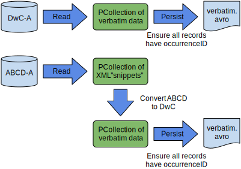

# Pipelines for data processing and indexing

_Status: early development_

Vision: Consistent data processing pipelines (parsing, interpretation and quality flagging) for use in GBIF, the Living Atlases project and beyond. 
Built to scale from laptop to GBIF volumes.  Deployable on JVM, Spark, Google Cloud, <insert your favourite cloud provider here>.

# Architecture

The project provides vanilla JVM-based parsing and interpretation libraries, and pipelines for indexing into SOLR and ElasticSearch, built using Apache Beam.  
Apache Beam provides a high level abstraction framework ideal for this purpose with the ability to deploy across target environments (e.g. Spark, local JVM) and with many built in connectors for e.g. HBase, SOLR, ElasticSearch etc.

## Ingress

Ingress is from Darwin Core Archive (zip files of one or more "CSV"s) or  ABCD Archives (compressed XML) only[1].
During ingress data is converted from it's native format and stored as Avro files containing Darwin Core compliant data.  
This is depicted below: 

  
[1] Other protocols (e.g. DiGIR, TAPIR) are supported by GBIF but are converted by crawling code upstream of this project.

## Interpretation

  
The project is structured as:

- _core_: The schemas, messages and functions to interpret data
- _hadoop_: Hadoop specific utilities (e.g. FileInputFormats)
- _demo_: The quick start project (currently a demo showing a DwC-A to Avro file creation)
- _gbif_: The GBIF specific indexing pipelines (currently a demo showing an ES sink using Spark deployment)
- _living_atlases_: The Living Atlas specific indexing pipelines (currently a demo showing a SOLR sink)

